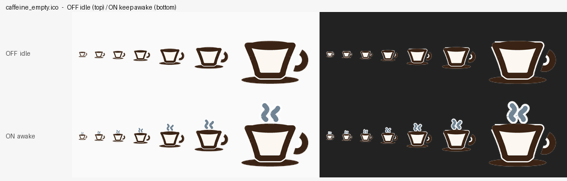
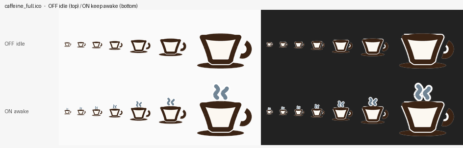

# 咖啡因 Caffeine for Windows

[](https://github.com/John-Shaw/caffeine-windows/actions/workflows/ci.yml)
[](LICENSE)


Windows 托盘防休眠小工具。行为照搬 macOS 上的 Caffeine：托盘里一只空咖啡杯，
**点一下变成满杯冒热气**（系统睡眠 / 休眠 / 息屏全部关掉，保持唤醒），
**再点一下变回空杯**（把你原来的电源设置原样还回去）。




- 单文件 `Caffeine.exe`，**不需要装任何运行时**（只用 Windows 自带的 .NET Framework 4.x）
- 不联网、不装服务、不写注册表服务项；所有数据都在 `%LOCALAPPDATA%\Caffeine`
- 原样还原你的默认设置；**万一读不到，就按「1 小时后睡眠」这个默认值兜底**
- 就算被强杀/崩溃，下次启动会自动把设置还原，不会把你的机器留在「永不睡眠」状态

## 下载

| 方式 | 说明 |
| --- | --- |
| **[安装包（推荐）](https://github.com/John-Shaw/caffeine-windows/releases/latest)** | 页面上的 `Caffeine-Setup-<版本>.exe`，双击即可。按用户安装，**不需要管理员**；重复运行就是覆盖升级，你的设置和开机自启都会保留 |
| [免安装版](https://github.com/John-Shaw/caffeine-windows/releases/latest) | 同一页的 `Caffeine.exe`，丢到任意目录双击运行 |
| [从源码构建](#自己编译) | 只需要系统自带的 `csc.exe`，不需要装 Visual Studio |

> ⚠️ **安装包没有代码签名**，从浏览器下载时 Windows 可能弹「Windows 已保护你的电脑」。
> 点 **更多信息 → 仍要运行** 就行。如果你介意这个，可以自己从源码构建。

## 文档

| | |
| --- | --- |
| [CHANGELOG.md](CHANGELOG.md) | 版本变更 |
| [CONTRIBUTING.md](CONTRIBUTING.md) | 构建方式、编码约定、改图标的说明 |
| [SECURITY.md](SECURITY.md) | 漏洞上报（这个 app 会改你的电源设置，值得一看） |
| [LICENSE](LICENSE) | MIT |

## 用法

| 操作 | 结果 |
| --- | --- |
| 左键点托盘图标 | 空杯 ⇄ 满杯（保持唤醒 / 恢复默认） |
| 右键点托盘图标 | 菜单：状态、立即恢复、允许显示器熄屏、开机自启、以管理员身份启动、退出 |
| 勾选「允许显示器自动熄屏」 | 勾上后保活期间**屏幕可以正常熄灭**，只有系统不休眠 |
| 勾选「开机自动启动」 | 写入 `HKCU\...\Run`，开机自动出现在托盘 |
| 退出时正在保活 | 会先问你一句，确认后恢复原设置再退出 |
| 关机 / 注销时正在保活 | 退出前自动恢复原设置 |

勾选中的项左边有绿色对勾、并且**文字加粗**，一眼就能看出开没开。

命令行参数（维护用）：

```
Caffeine.exe              正常启动（托盘）
Caffeine.exe --selftest   打印一份自检报告（电源方案、权限、图标、写入往返）
Caffeine.exe --restore    手动修复：把上次没还原的设置还原回去
```

## 安装

**去 [Releases](https://github.com/John-Shaw/caffeine-windows/releases/latest) 下载 `Caffeine-Setup-<版本>.exe`，双击即可。**
按用户安装到 `%LOCALAPPDATA%\Programs\Caffeine`，不需要管理员，会建开始菜单快捷方式；
重复运行同一个安装包就是覆盖升级，你的设置和开机自启都保留。

命令行参数（一般用不到）：

```
Caffeine-Setup-1.1.0.exe                  交互式安装 / 覆盖升级
Caffeine-Setup-1.1.0.exe --silent --no-launch   静默安装，不启动（部署脚本用）
Caffeine-Setup-1.1.0.exe --dir "D:\Apps\..."     换安装位置
Caffeine-Setup-1.1.0.exe --uninstall --quiet     静默卸载
Caffeine-Setup-1.1.0.exe --version              打印内置的版本号
```

不想装：把 `Caffeine.exe` 丢到任何目录双击运行即可（`install.bat` 也还可以用，
它就是复制文件 + 建快捷方式）。

开机自启也可以事后在托盘右键菜单里勾选。

> **图标在哪儿？** Windows 11 默认只显示「固定」的图标，新程序会躲在
> 托盘右侧的 **`^`（显示隐藏的图标）** 里。点开它找到咖啡杯，拖到外面就能固定。
> 菜单里还有「开机自动启动」。

## 它到底做了什么

点一下「保持唤醒」时做三件事，两层保险：

1. **SetThreadExecutionState**（免管理员权限）
   每 10 秒向系统声明一次「我要保持唤醒 / 屏幕别关」。这一层立刻生效，
   进程活着就不会自动睡眠或息屏。

2. **改写电源方案**（把「从不」设成 0 秒）
   直接用电源 API 把当前电源方案里的这几项写成 0（= 从不）：

   | 设置 | 含义 |
   | --- | --- |
   | `STANDBYIDLE` | 在此时间后睡眠 |
   | `HIBERNATEIDLE` | 在此时间后休眠 |
   | `DISKIDLE` | 在此时间后关闭硬盘 |
   | `VIDEOIDLE` | 在此时间后关闭显示 |

   这一层的好处是：就算程序崩了、被强杀了，机器也不会「睡过去」。

3. **关闭系统休眠**（`powercfg /hibernate off`，**需要管理员权限**）

   这是唯一需要管理员的一步。**失败也不影响保活效果** —— 上面所有超时时间
   已经是「从不」，睡眠根本不会触发，自然也就轮不到休眠。程序只在第一次遇到
   这种情况时提示一次，不会反复弹窗。

再点一下时按相反顺序撤销，并且**只撤销自己改过的项**：如果你在保活期间自己
去改过某个超时值，咖啡因不会把它覆盖回去。

### 读不到默认设置怎么办

按你的要求兜底成 **1 小时**：

- `STANDBYIDLE` / `VIDEOIDLE` / `DISKIDLE` 交流与直流都设成 3600 秒
- 托盘弹一次「已使用默认设置：1 小时后进入睡眠」，日志里也记下来

### 崩溃 / 强杀保护

改设置**之前**先把原始值写进 `%LOCALAPPDATA%\Caffeine\pending-restore.cfg`，
还原成功后删除。所以：

- 强杀程序 → 文件还在 → 下次启动自动还原（日志里能看到）
- 关机 / 注销时还在保活 → 退出前自动还原
- 兜底命令：`Caffeine.exe --restore`

## 关于管理员权限

| 操作 | 是否需要管理员 |
| --- | --- |
| 保持唤醒（睡眠 / 息屏 / 硬盘超时归零） | **不需要**（本机实测写入成功） |
| `SetThreadExecutionState` 保活 | 不需要 |
| `powercfg /hibernate off`（真正关掉系统休眠 / 快速启动） | **需要** |
| 开机自启 | 不需要（写 `HKCU\...\Run`） |

想一次到位，右键菜单里点「**以管理员身份重新启动**」。不点也能正常保活。

## 文件说明

```
Caffeine.exe        唯一需要的文件
install.bat         可选安装脚本
README.md           本文件
```

运行时数据：`%LOCALAPPDATA%\Caffeine\`

| 文件 | 用途 |
| --- | --- |
| `caffeine.log` | 运行日志（每次开关都记了原始值与写入返回码） |
| `settings.cfg` | 你的偏好（允许熄屏 / 开机自启 / 已提示过哪些气泡） |
| `pending-restore.cfg` | 崩溃保护：存在就说明上次没还原完 |
| `selftest.txt` | `--selftest` 的报告 |

托盘右键菜单里的「打开数据文件夹」可以直接跳到这里。

## 界面细节

- **DPI 感知**：程序清单里声明了 per-monitor v2。你的屏幕是 4K 200% 缩放，
  声明之前 Windows 会把整个界面按 1 倍画好再拉伸 2 倍，菜单文字就会糊成一团；
  声明之后菜单按 192 DPI 原生绘制，文字是清晰的。托盘图标也会按
  `SM_CXSMICON` 选对应尺寸（100% 用 16px，200% 用 32px），并跟随 DPI 切换重建。
- **菜单文字**用 GDI 绘制在菜单的不透明背景上，避免 GDI+ ClearType 在分层窗口上
  出现红蓝色边。
- **勾选项**用自绘的深绿色对勾 + 加粗文字，不依赖系统主题的淡色对勾。
- **菜单行距**：WinForms 默认把菜单项高度卡在文字高度上，200% 缩放下实测是
  36px 行距配 23px 字高，上下只剩 13px，中文看着挤成一坨。给每一项加了按 DPI
  换算的上下内边距后变成 **44px 行距**，字高不变。
- **托盘图标的尺寸是量出来的，不是猜的**：图标格是 32px（`SM_CXSMICON`），但图形
  本身只填了一半高度——蒸汽占着杯子上方的空间，即使在空杯状态下那段也是空的，
  实测闲置墨迹只有 24×16px。现在 `tools\make_icons.py` 顶部的 `INK_SCALE = 1.18`
  把整幅图**等比**放大（杯/碟/把手比例一点没动），闲置墨迹变成 28×18px。
  横向已经占到格子的 77%，所以 1.18 基本就是不动设计时的上限了。
- 菜单只在该出声的时候出声：正常开关不弹窗，只有真正出错（改不动电源方案）、
  1 小时兜底、以及**仅第一次**遇到「关休眠需要管理员」时提示一次。

## 自己编译

只需要 Windows 自带的 `csc.exe`，不用装 Visual Studio / .NET SDK：

```powershell
powershell -ExecutionPolicy Bypass -File .\build.ps1
```

图标是用 Python + Pillow 画的矢量图（`tools\make_icons.py`），
改了想重新生成：

```powershell
python tools\make_icons.py
```

想看不同的放大倍率长什么样（按真实像素、深浅任务栏各渲染一遍）：

```powershell
python tools\icon_scale.py      # -> assets\icon_scale.png
```

量「图标在格子里到底占了多少」「菜单行距多少」用的诊断脚本：

```powershell
python tools\probe_tray.py assets\taskbar_idle.png assets\menu.png
powershell -ExecutionPolicy Bypass -File .\tests\shot-menu.ps1     # 拍下真实菜单
powershell -ExecutionPolicy Bypass -File .\tests\shot-taskbar.ps1  # 拍下真实任务栏
```

## 测试

```powershell
powershell -ExecutionPolicy Bypass -File .\tests\run-tests.ps1
```

编译成一个控制台测试程序，直接驱动真实的 `TrayContext`，断言 63 项：
完整的开→关循环、连点、允许熄屏、崩溃恢复、1 小时兜底、设置往返，
**跑完一定把机器恢复成进来之前的样子**（最后会打印并校验这一点）。

```powershell
powershell -ExecutionPolicy Bypass -File .\tests\verify-tray.ps1
```

启动真正的 `Caffeine.exe`，用 UI Automation 找到托盘图标，**发真实鼠标点击**
（单击 / 双击 / 按住 2.5 秒），再用 `powercfg /query` 核对系统的实际值。

```powershell
powershell -ExecutionPolicy Bypass -File .\tests\verify-menu.ps1
```

真实右键打开菜单，真实点击两个可勾选项，然后核对 `settings.cfg` 和
`HKCU\...\Run` 是不是真的跟着变了（开→关各一轮），同时把菜单截图存到
`assets\menu-*.png`，可以直接看对勾和文字清晰度。

```powershell
powershell -ExecutionPolicy Bypass -File .\tests\verify-install.ps1
```

安装 / 覆盖升级 / 卸载全流程，断言 33 项：全新安装 → 同版本重装 →
现场编一个真的 1.2.0 覆盖装上去（校验 `DisplayVersion` 和 exe 版本都变了、
用户设置和开机自启都保留）→ 真实 GUI 点一遍 → 卸载干净。

```powershell
powershell -ExecutionPolicy Bypass -File .\tests\shot-setup.ps1 x 3
powershell -ExecutionPolicy Bypass -File .\tests\shot-uninstall.ps1
```

只截图、不改系统：把安装器三个阶段和卸载确认框的窗口拍下来存到
`assets\setup_step*.png` / `assets\uninstall.png`，用来肉眼检查高 DPI 下的排版。

## 关于高 DPI

托盘菜单和安装器都带 per-monitor v2 的 DPI 感知 manifest（`src\app.manifest`），
所以 200% 缩放下文字是原生渲染的，不是位图拉伸。

安装器的布局**不用** `AutoScaleMode.Dpi`：那玩意在顶层窗体上会只缩字体不缩控件
坐标，结果就是 200% 下 18pt 的字塞在按 9pt 排的框里，标题压住副标题、复选框文字
被切一半。`setup\Dpi.cs` 里的 `Lay` 改成手工算：所有坐标按 96dpi 单位写，
创建控件时统一乘以 `设备 DPI / 96`；**字号不乘**——pt 本身就是 DPI 相对的，
系统已经缩过一次，再乘一次就变成两倍大的字。

## 已知限制

- Windows 11 托盘会把长按转换成「一次点击」，所以按住不放会切换一次
  （不会像以前那样连发几十次）。
- 双击图标只算一次点击（想要两次就点两下，间隔稍大一点）。
- 「以管理员身份重新启动」会先还原当前设置再拉起高权限实例，UAC 会弹一次。
- 关闭「系统休眠」会顺带关掉「快速启动」，这是 Windows 本身的行为；
  还原时会一并开回来。
- 安装包未做代码签名（见 [下载](#下载)）。
- 本项目只覆盖 Windows 10 / 11 桌面版。没有 ARM64 原生构建，ARM 机器靠 x64 模拟运行。

## 致谢

造型参考的是 macOS 上的 [Caffeine](https://intworks.com/caffeine/)（Intworks）。
图标、菜单、安装器和全部代码均为本仓库独立实现，未使用其任何资源。

## 许可证

[MIT](LICENSE) © 2026 JohnShaw
